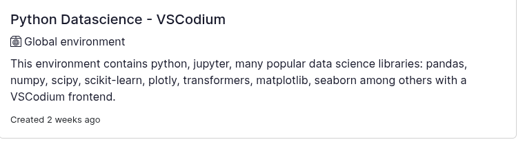
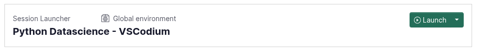
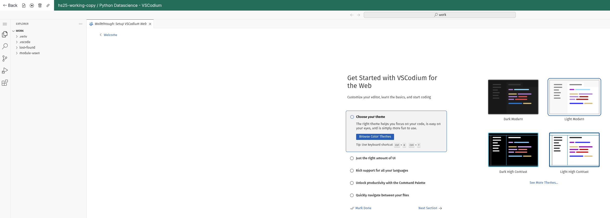

# Software Development HS26

## Einführung

In diesem Projekt findest du alle Unterlagen für das Semester HS26 des Moduls Software Development an der Berner Fachhochschule.

## Anmelden auf Gitlab der BFH
- Melde dich auf unserer [Gitlab](https://gitlab.ti.bfh.ch/) Instanz an.
  - Nur mit Kürzel (z.b. ggm7) und Passwort.
  - Richte 2FA / Passkey ein und notiere dir den Recovery Code.

- Sende eine E-Mail mit dem Kürzel an marcel.gygli@bfh.ch dann können wir dich auf dem [Projekt](https://gitlab.ti.bfh.ch/digital-sustainability-lab/lehre/wsdv) freischalten

## Arbeiten mit Renkulab

Um den Einstieg ins Programmieren nicht mit Installieren und Konfigurieren von Software zu erschweren haben wir uns entschieden auf Renkulab zu setzen. 

## Repository forken

Damit Renkulab **automatisch** deine Arbeiten speichern kann musst du deine eigene Instanz erstellen. Gehe dazu folgendermassen vor:

### Erstelle einen Account

- Klicke auf **Login**:

- Wähle SWITCH edu-ID:

### Erstelle eine Kopie
- Öffne das Grundprojekt: [HS26](https://renkulab.io/p/marcel.gygli/wsdv-hs26)

- Klicke rechts bei **Info** auf **das Icon** und dann **Copy Project**:

- Wähle im Modal die Einstellung **Private** und klicke auf **Copy*

> Der Vorteil von Private ist, dass du nicht ausversehen eine Session startest ohne eingeloggt zu sein. Deine Änderungen können nur gespeichert und wiederhergestellt werden, falls du eingeloggt bist.

- Wir empfehlen dir ein Bookmark zu erstellen damit du schnell und ohne Umwege auf deine Modul Resourcen zugreiffen kannst. 

## Erstellen einer Session

Öffne die von dir erstellte Kopie in Renkulab

Unter **Sessions** klicke auf das **+** Zeichen
Mache folgende Einstellungen im Modal welches sich öffnet:

   

Klicke auf **Next** und im folgenden Fenster auf **Add Session Launcher**

Danach kann die Session gestartet werden:

## Starten von Codes

Nach dem Starten der Session sollte sich folgender Bildschirm öffnen:

Die Unterlagen für den Unterricht finden sich im Ordner "module-wsen -> notebooks -> Unterricht"